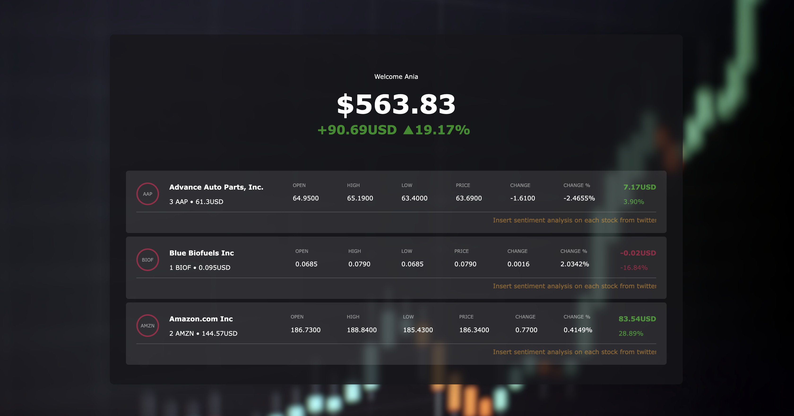

# Singlestore Market Sentiment App!

This AI App will allow the user to get live data on their purchased stocks, aswell as sentiment analysis on the stocks from twitter that we store in our vector database on SingleStore!



This app was created using `create-singlestoredb-app`

## To start this project:
### 1. Sign up to Singlestore and create a workspace

You can sign up here: https://www.singlestore.com

### 2. Run the following script in a SingleStore Personal Notebook

You can find the script [here](tweets.ipynb)

You can find a back up of the CSV file mentioned in the script in this project [here](https://github.com/kubowania/tweet_sentiment_stock_market)

### 2. Create a `.env file`

Create a `.env` file in the root of your project and put the followng code in it:
```
USERNAME={your_singlestore_username}
HOST={your_singlestore_host}
PASSWORD={your_singlestore_password}
DB_PORT={your_singlestore_port}
ALPHA_KEY={your_alpha_api_key}
OPENAI_API_KEY={your_openai_api_key}
```
If you are struggling with this, please watch the full tutorial on Code With Ania Kubow.

### 3. Run `npm i`

This will install all the dependencies and their versions from the package.json file.

### 4. Run the command `npm run dev`

This will start the app on http://localhost:3000

### 5. Check out your dashboard!

And we are finished!
